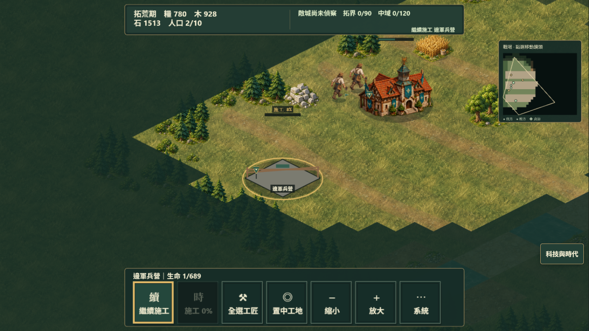
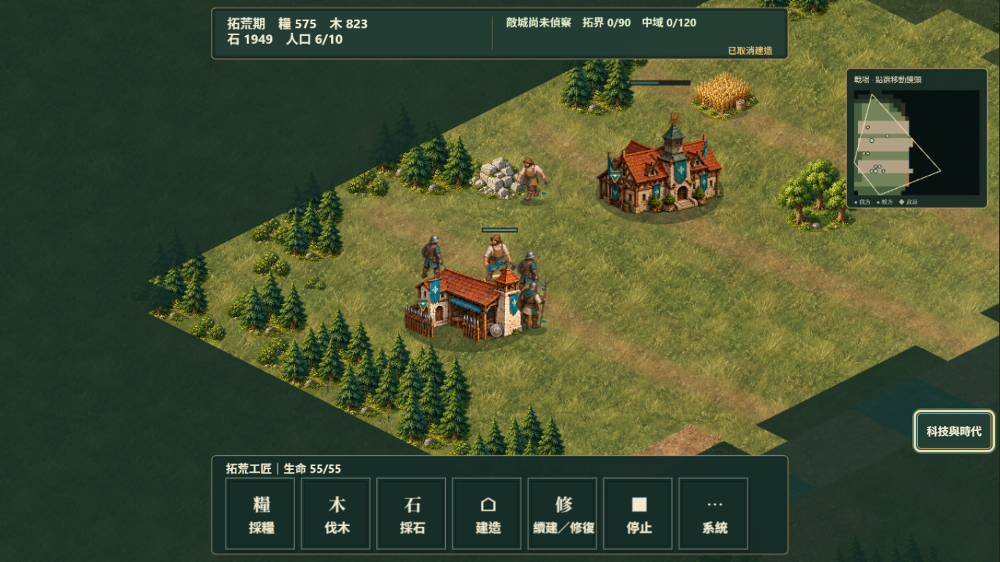

# R25 視覺與操作體驗：公開 1.0.0

這場最影響觀感的是人物過大、地面紋理重複，以及建造預覽與點擊判定不一致。角色和房屋有細節，但人幾乎和樹一樣高；靠近主城的綠色建造預覽點下去，卻連續被當成點到既有物件。我花在找空地與恢復施工的時間，比安排發展策略還多。

## 實際範圍

- 2026-10-01，公開 `play.html?v=1.0.0`，基準 commit `90e2a412`，1366×768，自己的 Chromium `r25-visual`。
- 09:54:10Z 開始戰場，10:09:35Z 讀回紀錄，牆鐘經過 925.6 秒。最後一份正常自動存檔是 tick 7764，即 776.4 秒正常模擬時間；超過五分鐘。開科技面板會暫停，沒有加速等待。
- 保留預設均衡／標準 AI。只用實際滑鼠、右鍵、拖曳和鍵盤代理操作；沒有讀取 runtime 下令、`issue`、`step`、改 seed、給資源、停 AI，或匯入已付費進度。
- 五分鐘後才讀來源碼。最後僅讀自己的自動存檔 metadata，用來核對時間與仍在進行的戰局。這是單一 AI 操作體驗，不是真人調查或實體手機測試。

操作原始紀錄：[visual-before-steps.json](evidence/r25/visual-before-steps.json)。Console error 查詢為 0。

## 真正做了什麼

1. 實點開始戰役，觀察工匠、主城與草地。起始工匠本來就在採集。
2. 依第一張畫面位置嘗試點三名工匠與資源，但工匠已移動；這三次沒有得到採集成功訊息，不算成功操作。之後選到石礦旁的工匠，真正按採石，得到「工匠前往採集石礦」。
3. 從原生科技面板的木作營前置按鈕進入建造。近主城試了三個位置；其中綠色預覽仍回「建造位置被單位或資源占用」。改到遠處空地才得到「開始建造 木作營」。
4. 真正放下邊軍兵營。選著帶石工匠點主城，結果變成卸貨，兵營停在 0%；經原生工地快捷入口按繼續施工後，兵營完成。
5. 真正按生產 UI 排入兩名邊境戰士與一名持盾槍衛。後續畫面可見三名士兵，實點全選軍隊與右鍵移動得到「移動 3 個單位」。
6. 嘗試原生城寨期升級。材料夠，兵營已達成，但木作營前置不成立。重新點木作營快捷入口回到新建造模式，末尾自己的建築清單也沒有木作營。它先前曾呈現完整建築外觀；我沒有親眼看到它何時被拆除，不能把這次情況武斷寫成施工未完成。
7. 拖曳鏡頭看河岸和行軍。末尾仍為拓荒期、戰局進行中；自己的兩名工匠與一名持盾槍衛仍在，兩名戰士已不在最後自動存檔。這場沒有取得勝利，也沒有完成科技研究。

## 觀察與優先順序

| 優先 | 實際觀察 | 對遊玩的影響 | 證據 |
| --- | --- | --- | --- |
| P1 | 工匠與步兵約有一棟房屋畫面高度的一半，工匠接近小樹高度 | 房屋像模型，單位不像住在同一個世界；兵營旁三名士兵很擠 | 圖 01、12 |
| P1 | 草地的同形草束與亮暗區塊規律重複，河岸是整齊菱形鋸齒；渡口像幾塊材質拼接 | 地圖很平，河流像貼在板上的色塊。AoE III 品質目標要求景物尺度一致、地形有連續層次 | 圖 01、13、14 |
| P1 | 570,550 的預覽為綠色，點下去仍被當作點到既有物件 | 玩家無法相信綠色合法提示，必須猜另一個位置 | 圖 04、05；步驟紀錄 |
| P1 | 左點主城在工匠帶貨時會先卸貨，剛下的施工因此中斷 | 我本來想管理主城，卻改掉工匠工作；要另外繞到工地續建 | 圖 08、09 |
| P2 | 初期施工只是平灰菱形，進度與健康都很低，缺少可讀的施工階段 | 和完成建築的畫風差距大，也不容易分清停工或正常慢慢蓋 | 圖 06、09 |
| P2 | 單位身上陣營色主要靠小旗、細節與選取圈；士兵靠在屋頂旁更難辨認 | 我方三種輪廓可辨，但大身體與小色記同時出現，隊伍辨識仍弱 | 圖 12 |
| P2 | 上方戰況提示只是一行小字；人口下降、木作營消失時，沒有被我即時注意到 | 這場的威脅感和損失回饋不足。我沒有可靠看見完整命中過程，不能宣稱打擊感通過 | 圖 09、末尾紀錄 |

原生科技面板把材料與前置列得清楚，缺少木作營時也能指出原因。它能幫我找出卡在哪裡；問題出在回到戰場後的比例、點擊與施工表現。兵種與城寨升級的取捨確實要付費，這點成立。

另有一段鍵盤代理操作後出現暫停，按 P 後恢復。先前 locator 曾等待，尚未排除 runner 干擾；這項保留在原始步驟，不列為已確認的遊戲缺陷。

## 先體驗後查的來源根因

- `frameAnimatedCombatActor.ts`：畫面使用 authored `artScale`，沒有依房屋與地圖統一人體呈現尺度。工匠目前是 96×112、`artScale: 1` 的六向影格；縮 render image 的 presentation multiplier 可改善比例，同時保留原影格、容器座標與互動尺寸。
- `battleMap.ts`：材質 quadrant 縮到 0.6 後直接 `repeat`，各地形由逐格 `Path2D` 填色。素材本身的亮暗紋理會反覆出現，W 區域的直線邊也仍清楚。需要多尺度取樣與河岸的視覺過渡，不能改動共享可通行格。
- `villageAssaultArt.ts:108` 加上 Scene 的 `handleEntityTap`：建築的矩形互動尺寸包含整棟圖像高度，建造模式一旦收到 entity tap 就直接報物件占用；預覽卻依格點合法性顯示綠色。兩個判定路徑不同。
- Scene 的 `handleEntityTap`：帶貨工匠點我方收貨建築時，卸貨分支早於一般建築選取，能覆蓋剛開始的施工命令。這由 Root 的 Scene 改動處理，本 lane 不改 Scene。

## Before 圖

這些圖片均已用 `view_image` 檢視。後續修改由實際觀察決定，仍要在修改版重新操作，不能用程式測試代替娛樂度判斷。
