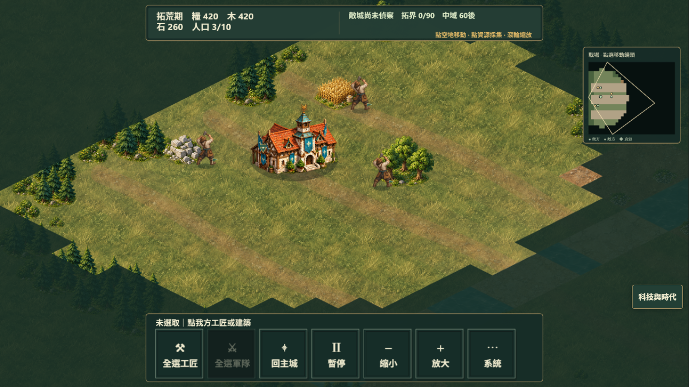
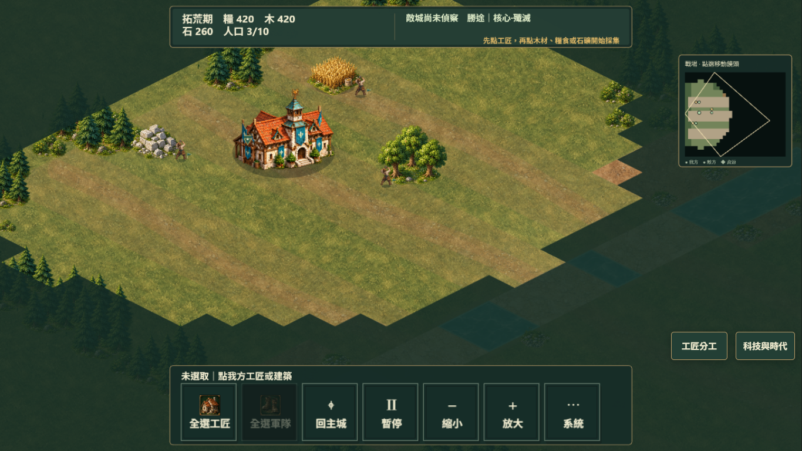
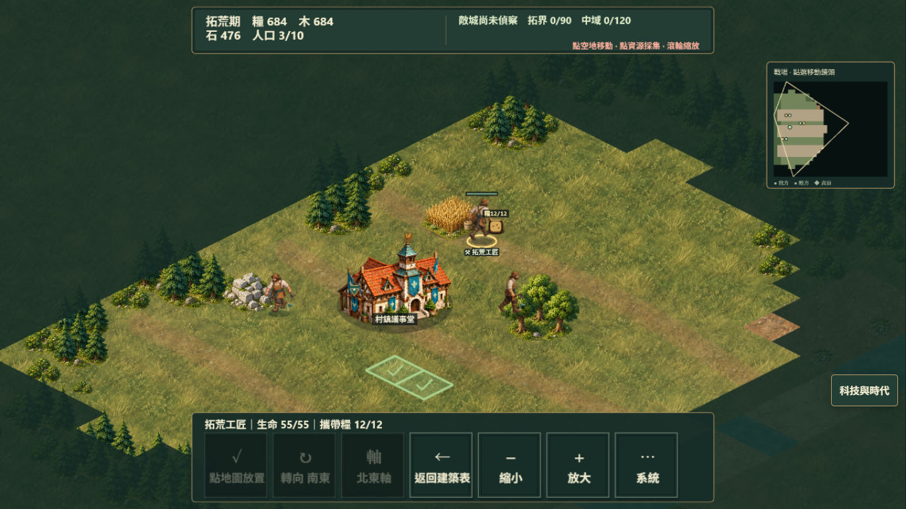
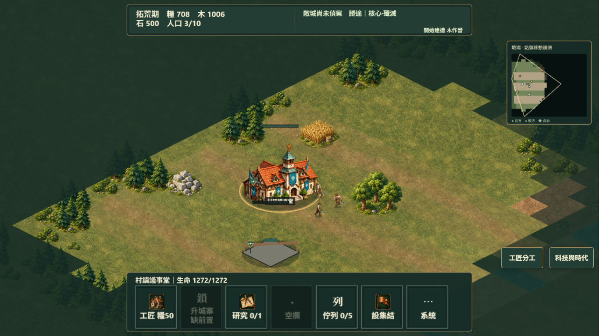
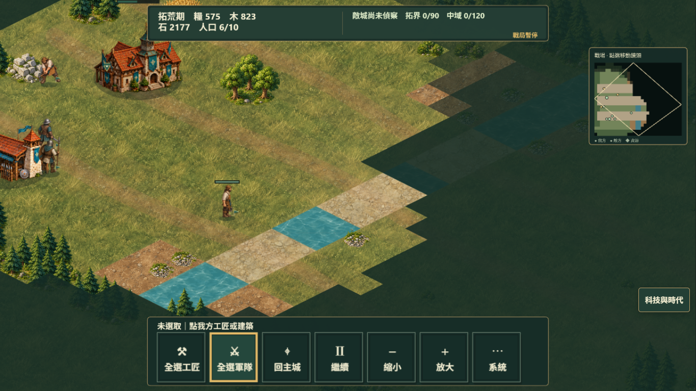
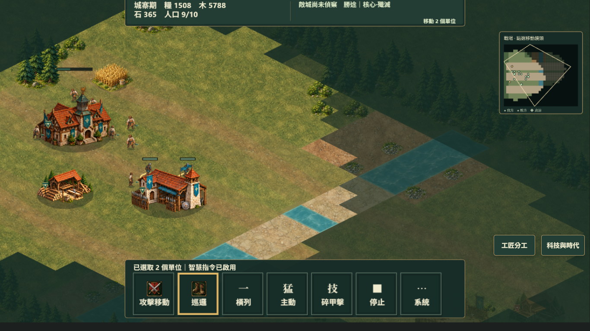
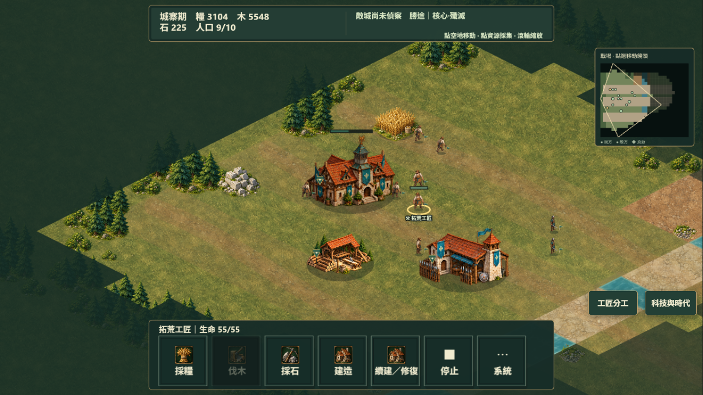

# R25 整合版 1.1.0：視覺與操作再體驗

人物比例和建造操作已改善，這次能在主城旁正常蓋木作營，再點主城管理生產，工匠沒有被改派去卸貨。工匠分工也讓補採糧比逐個追著小人物點容易。河岸和地面仍有明顯的格點幾何感；新圖示不能只靠縮小的圖片辨識，文字標籤仍很重要。

## 實際範圍

1366×768，自己的 `r25-visual-after`，`http://127.0.0.1:5174/`，實際入口顯示 1.1.0，規則仍為 `village-siege/0.20.0`。10:40:31Z 開始，11:06:27Z 讀回末尾紀錄。牆鐘經過 1555.8 秒，末尾自己的自動存檔 tick 13806，即 1380.6 秒正常模擬時間，超過五分鐘。

前半從零開始，用預設均衡／標準 AI。只用真正 UI 的滑鼠、鍵盤、右鍵和拖曳，沒有 `runtime.issue`、`step`、資源贈送、關 AI 或別人的完成進度。途中發現控制雙派送後，依 Root 的明確指示，**從 UI 匯出這場自己的存檔、手動 reload，再從 UI 匯入同一場**，接續驗證修改。不把重新匯入算成另一次從零遊玩。

最後仍在進行中：城寨期、方繩基準法完成、七名工匠和兩名戰士。沒有取得勝利，也沒有完整驗完七技能或手機體驗。本輪沒有量效能；等待其他體驗停止後另量。

紀錄：[visual-after-steps.json](evidence/r25/visual-after-steps.json)。Console error／warning 都為 0。

## 已用真操作核對的變化

| 項目 | 真正操作與可見結果 |
| --- | --- |
| 人物與房屋比例 | 起始工匠約房屋四分之一高度；兵營旁戰士也能和建築一起閱讀。角色的 authored 影格沒有被換成晃動單圖。圖 01、10 已檢視。 |
| 綠色建造預覽 | 在靠主城的 605,550 綠色格點真正下令，得到「開始建造 木作營」。這與 before 綠色預覽卻被物件 hit area 攔下的情況不同。圖 02、03。 |
| 主城管理 | 木作營剛下令後，左點主城 637,405，出現工匠訓練／研究／佇列控制；notice 仍為開始建造，後續木作營確實完成。沒有轉去卸貨或停在 0%。 |
| 工匠分工 | 真正把工匠 4／5／6 個別指派採糧，資源後續增加。對話框保留開啟，可連續指派；早期 runner 以為指派會關閉而等待另一個按鈕，屬 harness 假設，不算遊戲故障。 |
| 出兵與發展 | 真正從兵營排兩名戰士，原生城寨升級開始並完成，右鍵下令移動兩名戰士；原生方繩基準法研究開始，末尾卡片顯示研究完成。圖 09、10、12。 |
| 回饋文字 | 末尾 `.battle-feedback` 留有「方繩基準法研究完成」，讀回時已隱藏。沒有錄到聲音，不能以程式存在或播放計數冒稱聽覺品質通過。 |

## 這場抓到並重驗的雙派送

最初版本，主城空佇列時，兩次真正 DOM `click()` 工匠訓練，糧食 708→508、人口 3→7。Caption 每名糧 50，這是每個 gesture 執行兩次的缺陷。System 選單也會開後又關，讓下一個控制找不到。Root 修正 native proxy 與 Phaser pointer-up 同時派送；本 lane 沒改來源碼。

手動 reload 後，以自己 UI 匯出的前後存檔核對單次 click。比較時使用真正 P 暫停，避免正常採集把成本混入數字：

| 欄位 | Click 前 | Click 後 |
| --- | ---: | ---: |
| Tick | 7047 | 7047 |
| 糧食 | 508 | 458 |
| nextPlayerSequence | 9 | 10 |
| 主城佇列 | 0 | 1 |

一次操作只扣 50、只提交一筆、只排一項，之後已恢復正常遊玩。證據：[visual-after-single-train.json](evidence/r25/visual-after-single-train.json)。自己的存檔留在 `.audit-tmp/r25`，沒有發布。

## 還存在的問題

| 優先 | 觀察 | 影響／下一步 |
| --- | --- | --- |
| P2 | Native 控制操作後，主城 HUD 的第一行被裁掉約 20px | `window.scrollY=0`，`MAIN#game-root.scrollTop=20`，其 scrollHeight 788／clientHeight 768，canvas rect.y=-20。Root 已收到此確切證據；需要阻止 native focus 把遊戲容器捲動。圖 05、10。 |
| P2 | 主城 health bar 浮在塔頂上方約 50px | 人物 health anchor 已貼近人物；建築仍用整張 PNG 高度，可能把透明區也算進去。圖 03、05。 |
| P2 | 工匠指令圖示像小房子 | `commandIcons.ts` 把帶「工匠」的 label 映到 `build`。全選工匠／訓練工匠因此和建造語意混在一起。圖像的色調統一，但這兩個控制仍靠文字辨識。 |
| P2 | 渡口和河岸仍有直角、菱形與整段材質切面 | 細草取樣較自然，小波紋不再每格一樣；水格與合法渡口有保留。整體仍看得出格點板，距離 AoE III 品質目標的有機地形還有差距。圖 10。 |
| P2 | 發展後的下一個目標仍薄 | 本輪造村、分配採集、升級和研究都能做，卻花了很長時間留在基地。下一步偵查／集結／進攻可以更明確。沒有因按鈕通過就把娛樂度算通過。 |

## 有界來源檢查

- `previewBuildCommand` 只呼叫 `validateGameCommand(...).ok`；檢查可見性、時代、占用、其他單位、工匠可達性與成本，沒有寫入戰局。Scene 的預覽與真正 build 使用同一套驗證。
- PNG command atlas 切 frame 後由 Phaser image 顯示；地面是原創 PNG 經 canvas 烘焙後交給 WebGL。這些改動沒有 SVG。
- `battleFeedback` 的優先序保留來襲／損失訊息，避免採集提示覆蓋警告；完成訊息是四秒，警告七秒。`battleAudio` 需真 gesture 解鎖、impact 至少間隔 0.15 秒，destroy 會移除 listener 並關 context。這是來源檢查，不是聽覺評分。

## Before／After 對照

上述圖片已逐張用 `view_image` 檢視。效能樣本另記。

## 最後 freeze 的窄範圍確認

Root 完成最後來源修正後，再以正常 UI 匯出這場自己的最新存檔、手動 reload、正常 UI 匯入；沒有重算實玩時間或套用外來進度。最後三張圖均已用 `view_image` 看過：

- 工匠訓練圖示現在是實際工匠上半身，從小房子改回人物，語意已對上。
- 主城與兵營的血條已貼近屋頂；先前透明 PNG 邊界造成的大段空隙已消失。人物 health bar 與選取圈也貼在人物附近，真正點身體能選到工匠。
- 經主城、科技面板開關和人物選取，`root.scrollTop=0`、scrollHeight／clientHeight 都是 768、canvas rect.y=0。非 button live region 的 status／alert 都在 y=0、1×1；沒有再撐到 Canvas 下方。
- Console error／warning 仍為 0。此窄範圍沒有發現發布阻擋問題；地形幾何感、發展目標與未實測的聽覺品質仍照前文保留。

證據：[visual-final-check.json](evidence/r25/visual-final-check.json)。`r25-visual-after` 已用真 P 暫停保留，等其他體驗和全套檢查停止後才量效能。

