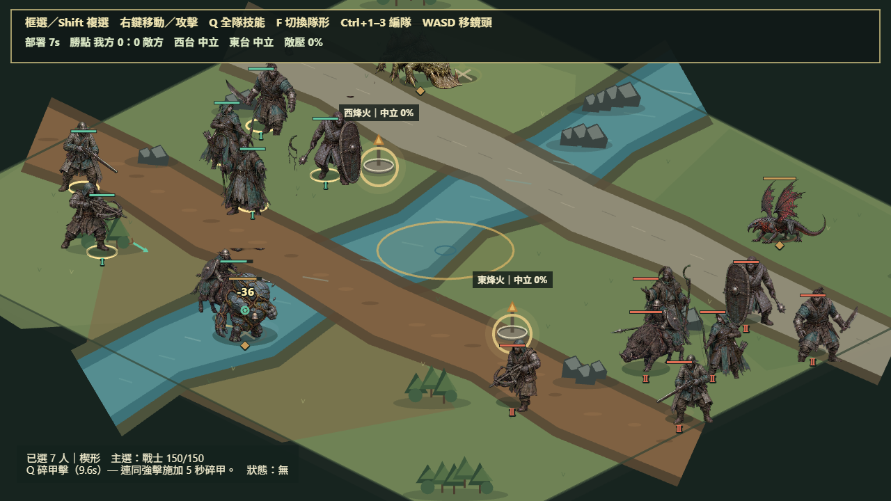

# Village Siege 新手指南

這份指南寫給第一次接觸 Village Siege 的玩家與開發者。只想玩單機時，不需要帳號、API 金鑰或多人伺服器。



## 一、五分鐘開始單機遊戲

### 1. 準備環境

你需要：

- Windows 10／11、macOS 或常見 Linux 發行版。
- Node.js 22.12 或更新版本。
- npm 11 或相容版本；安裝 Node.js 時通常會一併安裝。
- Chrome、Edge 或 Firefox 等支援 WebGL 的現代瀏覽器。

先確認版本：

```powershell
node --version
npm --version
```

如果 `node` 顯示的版本低於 `v22.12.0`，請先更新 Node.js。

### 2. 下載專案

已安裝 Git 時：

```powershell
git clone https://github.com/mars-tw/village-siege.git
Set-Location village-siege
```

也可以在 GitHub 專案頁選擇 **Code → Download ZIP**，解壓縮後用 PowerShell 進入該資料夾。

### 3. 安裝並啟動

在專案根目錄執行：

```powershell
npm ci
npm run dev:client
```

終端機出現網址後，用瀏覽器開啟 `http://localhost:5173`。如果 5173 已被其他程式使用，Vite 可能顯示另一個連接埠，請以終端機實際網址為準。

> 不要直接雙擊 `apps/client/index.html`；遊戲需要透過 Vite 啟動，才能正確載入模組與素材。

## 二、第一場戰役怎麼玩

第一次建議選擇：

- 村莊：**松林堡**，定位較均衡，適合熟悉操作。
- 電腦對手：**均衡者**，壓力比侵略者容易掌握。
- 模式：**開始單機戰役**。

進入戰場後按這個順序：

1. 按 `Ctrl+A` 選取七名我軍。
2. 在其中一座烽火台附近按右鍵，全隊會依目前隊形移動。
3. 讓單位留在烽火台範圍內，等待占領進度完成。
4. 遇敵時先讓盾牌手與戰士接敵，弓箭手、法師、火槍兵與重弩手留在後方。
5. 選取部隊後按 `Q`，會讓已選單位施放各自可用的主動技能。
6. 持續控制烽火台取得勝點；先達 100 分，或殲滅敵方主力即可獲勝。

野外怪物起初保持中立。不要在尚未站穩烽火台時主動攻擊牠們；怪物只會報復先傷害牠的一方。

## 三、操作表

| 操作 | 功能 |
|---|---|
| 左鍵單擊 | 選取一名我軍 |
| 左鍵拖曳 | 框選多名我軍 |
| `Shift` + 左鍵 | 加入或調整選取 |
| `Ctrl+A` | 選取所有存活我軍 |
| 右鍵地面 | 依目前隊形移動 |
| 右鍵敵人 | 指定攻擊目標 |
| `Q` | 已選部隊施放各自技能 |
| `F` | 切換楔形／橫列隊形 |
| `Ctrl+1`～`Ctrl+3` | 儲存編隊 |
| `1`～`3` | 召回編隊 |
| `Shift+1`～`Shift+3` | 將編隊加入目前選取 |
| `WASD`／方向鍵 | 平移戰場鏡頭 |
| `R` | 重新開始目前戰役 |
| `Esc` | 返回戰前會議 |

## 四、七種兵種快速認識

| 兵種 | 主要用途 | 新手提示 |
|---|---|---|
| 戰士 | 持續近戰、破甲前排 | 跟盾牌手一起守住接戰線 |
| 盾牌手 | 承受正面火力、反制衝鋒 | 優先放在遠程單位前方 |
| 弓箭手 | 機動遠程壓制、緩速 | 保持距離，避免被騎兵貼身 |
| 法師 | 範圍傷害、無視部分護甲 | 等敵人聚集後再施放技能 |
| 火槍兵 | 高單發穿甲 | 攻擊間隔較長，需要前排保護 |
| 野豬騎士 | 高速突進、干擾後排 | 繞側翼攻擊弓手或法師 |
| 重弩手 | 超遠程攻城、反騎乘 | 移動較慢，先找安全位置架設火力 |

沒有任何單一兵種能處理所有情況。新手最穩定的做法是「盾牌手／戰士在前、四種遠程在後、野豬騎士側翼突進」。

## 五、多人房間

目前多人功能包含 2～4 人房間、六碼房號、準備、房主開始、權威伺服器 tick 與 60 秒重連。**戰場的完整多人同步尚未完成，因此目前是連線架構原型，不是完整線上對戰版本。**

本機測試需要兩個終端機。

終端機一：

```powershell
npm run dev:server
```

終端機二：

```powershell
$env:VITE_COLYSEUS_URL = "http://127.0.0.1:2567"
npm run dev:client
```

接著：

1. 第一個瀏覽器選擇「多人連線」並建立房間。
2. 記下畫面上的六碼房號。
3. 用第二個瀏覽器或無痕視窗進入同一網址，輸入房號加入。
4. 所有玩家按下「準備」。
5. 房主按下「開始戰局」。

## 六、常見問題

### `node` 或 `npm` 不是可辨識的命令

Node.js 尚未安裝，或安裝後終端機沒有重新開啟。安裝 Node.js 22.12 以上版本，再關閉並重新開啟 PowerShell。

### `npm ci` 失敗

請確認目前位置是含有根目錄 `package.json` 與 `package-lock.json` 的 Village Siege 資料夾，並確認網路可連到 npm registry。不要在 `apps/client` 子目錄執行根目錄安裝指令。

### 瀏覽器只有空白畫面或素材載入失敗

1. 確認是使用 `npm run dev:client` 顯示的網址，而不是直接開啟 HTML。
2. 回到終端機查看第一個錯誤訊息。
3. 停止伺服器後重新執行 `npm ci` 與 `npm run dev:client`。
4. 確認瀏覽器已開啟硬體加速並支援 WebGL。

### 連不上多人房間

- 確認 `npm run dev:server` 仍在執行，且顯示監聽 `http://localhost:2567`。
- 確認客戶端啟動前已設定正確的 `VITE_COLYSEUS_URL`。
- 若改用其他連接埠，伺服器與客戶端設定必須一致。
- Windows 防火牆詢問 Node.js 網路權限時，至少允許私人網路。

改用 2667 連接埠的範例：

```powershell
# 終端機一
$env:PORT = "2667"
npm run dev:server

# 終端機二
$env:VITE_COLYSEUS_URL = "http://127.0.0.1:2667"
npm run dev:client
```

### 如何確認下載的版本可以正常建置

```powershell
npm run verify
```

這會執行型別檢查、共享模擬測試與正式建置。多人房間另可執行：

```powershell
npm run smoke:multiplayer:local
```

## 七、參與開源開發

Village Siege 使用 [MIT License](../LICENSE)。歡迎 fork、研究、修改與提交 pull request。

提交前請：

1. 從最新 `main` 建立自己的功能分支。
2. 不要提交 `.env`、`node_modules`、`dist` 或個人登入資料。
3. 執行 `npm run verify`。
4. 若修改多人功能，再執行 `npm run smoke:multiplayer:local`。
5. 在 pull request 說明改了什麼、原因、玩家影響與驗證結果。

美術素材與產生流程的授權說明請參考 [素材署名與來源](../assets/ATTRIBUTION.md)。
