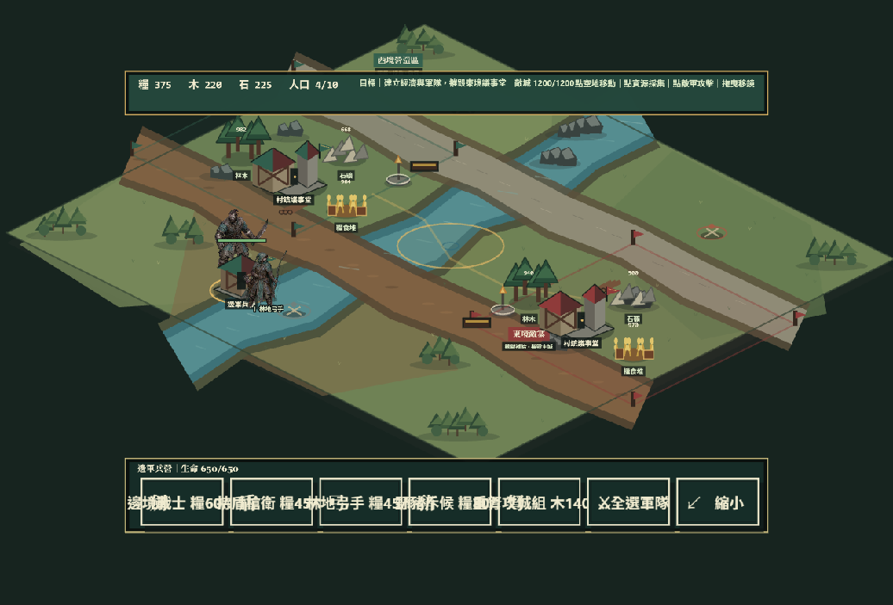

# Village Siege 新手指南

這份指南寫給第一次接觸 Village Siege 的玩家與開發者。只想玩單機時，不需要帳號、API 金鑰或多人伺服器。

只想直接遊玩，請開啟 **[GitHub Pages 公開單機版](https://mars-tw.github.io/village-siege/)**；後面的本機安裝步驟主要提供給想研究或修改程式的人。



## 一、五分鐘開始單機遊戲

### 1. 準備環境

你需要：

- Windows 10／11、macOS 或常見 Linux 發行版。
- Node.js 22.12 或更新版本。
- npm 11 或相容版本；安裝 Node.js 時通常會一併安裝。
- Chrome、Edge 或 Firefox 等支援 WebGL 的現代瀏覽器。

先確認版本：

```powershell
node --version
npm --version
```

如果 `node` 顯示的版本低於 `v22.12.0`，請先更新 Node.js。

### 2. 下載專案

已安裝 Git 時：

```powershell
git clone https://github.com/mars-tw/village-siege.git
Set-Location village-siege
```

也可以在 GitHub 專案頁選擇 **Code → Download ZIP**，解壓縮後用 PowerShell 進入該資料夾。

### 3. 安裝並啟動

在專案根目錄執行：

```powershell
npm ci
npm run dev:client
```

終端機出現網址後，用瀏覽器開啟 `http://localhost:5173`。如果 5173 已被其他程式使用，Vite 可能顯示另一個連接埠，請以終端機實際網址為準。

> 不要直接雙擊 `apps/client/index.html`；遊戲需要透過 Vite 啟動，才能正確載入模組與素材。

## 二、第一場戰役怎麼玩

第一次建議選擇：

- 村莊：**松林堡**，定位較均衡，適合熟悉操作。
- 電腦對手：**均衡者**，壓力比侵略者容易掌握。
- 模式：**開始單機戰役**。

進入戰場後按這個順序：

1. 按底部 **全選工匠**，再點附近的木材、糧食或石礦；上方資源數字會增加，資源點數量會下降。
2. 選取工匠後按 **建造**，先蓋一棟 **拓荒家屋**，完工後人口上限會由 10 增加到 18。
3. 再蓋 **邊軍兵營**。放置後工匠會走到工地，建築會從地基、鷹架逐步完成。
4. 點完成的兵營，把戰士、槍衛、弓手、法師、火銃兵、野豬斥候或重弩攻城組加入訓練佇列。
5. 產出至少三名軍事單位後按 **全選軍隊**，點地圖往東推進；接近敵人後點敵軍或敵方建築進攻。
6. 摧毀敵方議事堂並守住 60 秒重建寬限即可征服；若自己的議事堂先失守，同樣會進入重建倒數。

木作營與糧秣所不是裝飾：在對應資源點六格內完工後，附近木材或糧食的採集量會提高 50%。守望塔會自動攻擊進入射程的敵軍。

## 三、操作表

| 操作 | 功能 |
|---|---|
| 點／左鍵我方單位或建築 | 選取；兵營與議事堂會自動顯示可訓練項目 |
| `Shift` + 左鍵我方單位 | 加入或移出目前選取 |
| 點／左鍵資源 | 已選工匠前往並持續採集 |
| 點／左鍵空地 | 已選單位移動；建造模式時放置建築 |
| 點／左鍵敵人 | 已選軍事單位指定攻擊目標 |
| 拖曳空地 | 平移戰場鏡頭；拖曳不會誤放建築 |
| `B` | 以目前選取的工匠開啟建造模式 |
| `WASD` | 平移戰場鏡頭 |
| 滑鼠滾輪／Canvas `＋` `－` | 拉近或拉遠鏡頭 |
| `P` | 暫停或繼續共享模擬 |
| `R` | 重新開始目前戰役 |
| `Esc` | 先取消建造；沒有子模式時返回戰前會議 |

手機橫向時使用完全相同的智慧點擊。底部只有一排情境指揮塢：選工匠顯示建造，選議事堂顯示工匠，選兵營顯示七種軍事單位。568×320 下操作列不會和上方資源列重疊；直向時遊戲會暫停並顯示橫放提示。

## 四、七種軍事單位快速認識

| 兵種 | 主要用途 | 新手提示 |
|---|---|---|
| 戰士 | 低成本持續近戰 | 最快組成第一波防線 |
| 持盾槍衛 | 兩格攻距與較高單次傷害 | 站在弓手前方接敵 |
| 弓手 | 五格遠程輸出 | 保持距離，避免被斥候貼身 |
| 法師 | 高傷害中距輸出、人口 2 | 石材成本高，適合補強成熟經濟 |
| 火銃兵 | 高單發遠程、人口 2 | 攻擊較慢，需要前排保護 |
| 野豬斥候 | 最高移速與大視野 | 先偵查敵城，再帶主力進攻 |
| 重弩攻城組 | 高生命與高建築傷害、人口 3 | 木石成本高，適合終結敵方議事堂 |

工匠不列入七種軍事單位；它負責採集與施工。沒有任何單一兵種能處理所有情況，新手最穩定的做法是「戰士／槍衛在前、弓手／法師／火銃在後、野豬斥候先探路、重弩攻城組拆主城」。

## 五、多人房間

目前多人功能包含 2～4 人房間、六碼房號、準備、房主開始、權威伺服器 tick 與 60 秒重連。**戰場的完整多人同步尚未完成，因此目前是連線架構原型，不是完整線上對戰版本。**

本機測試需要兩個終端機。

終端機一：

```powershell
npm run dev:server
```

終端機二：

```powershell
$env:VITE_COLYSEUS_URL = "http://127.0.0.1:2567"
npm run dev:client
```

接著：

1. 第一個瀏覽器選擇「多人連線」並建立房間。
2. 記下畫面上的六碼房號。
3. 用第二個瀏覽器或無痕視窗進入同一網址，輸入房號加入。
4. 所有玩家按下「準備」。
5. 房主按下「開始戰局」。

## 六、常見問題

### `node` 或 `npm` 不是可辨識的命令

Node.js 尚未安裝，或安裝後終端機沒有重新開啟。安裝 Node.js 22.12 以上版本，再關閉並重新開啟 PowerShell。

### `npm ci` 失敗

請確認目前位置是含有根目錄 `package.json` 與 `package-lock.json` 的 Village Siege 資料夾，並確認網路可連到 npm registry。不要在 `apps/client` 子目錄執行根目錄安裝指令。

### 瀏覽器只有空白畫面或素材載入失敗

1. 確認是使用 `npm run dev:client` 顯示的網址，而不是直接開啟 HTML。
2. 回到終端機查看第一個錯誤訊息。
3. 停止伺服器後重新執行 `npm ci` 與 `npm run dev:client`。
4. 確認瀏覽器已開啟硬體加速並支援 WebGL。

### 連不上多人房間

- 確認 `npm run dev:server` 仍在執行，且顯示監聽 `http://localhost:2567`。
- 確認客戶端啟動前已設定正確的 `VITE_COLYSEUS_URL`。
- 若改用其他連接埠，伺服器與客戶端設定必須一致。
- Windows 防火牆詢問 Node.js 網路權限時，至少允許私人網路。

改用 2667 連接埠的範例：

```powershell
# 終端機一
$env:PORT = "2667"
npm run dev:server

# 終端機二
$env:VITE_COLYSEUS_URL = "http://127.0.0.1:2667"
npm run dev:client
```

### 如何確認下載的版本可以正常建置

```powershell
npm run verify
```

這會執行型別檢查、共享模擬測試與正式建置。多人房間另可執行：

```powershell
npm run smoke:multiplayer:local
```

## 七、參與開源開發

Village Siege 使用 [MIT License](../LICENSE)。歡迎 fork、研究、修改與提交 pull request。

提交前請：

1. 從最新 `main` 建立自己的功能分支。
2. 不要提交 `.env`、`node_modules`、`dist` 或個人登入資料。
3. 執行 `npm run verify`。
4. 若修改多人功能，再執行 `npm run smoke:multiplayer:local`。
5. 在 pull request 說明改了什麼、原因、玩家影響與驗證結果。

美術素材與產生流程的授權說明請參考 [素材署名與來源](../assets/ATTRIBUTION.md)。
