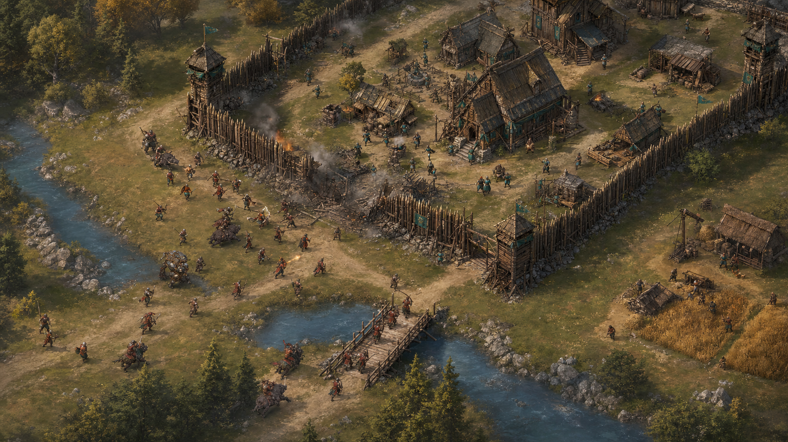

# Village Assault Visual Target V1

## Status

Original AI-generated concept reference. This is an art-direction target, not a runtime map, sprite atlas or proof of final gameplay.

## What this target establishes

- A readable command hall, palisade perimeter, gate breach, towers and civilian/economic buildings.
- Continuous non-grid terrain with river, bridge, roads, fields and tree lines.
- Clear attacker approach, breach lane and defensive depth.
- Practical timber, stone, linen, leather and blackened-iron material language.
- Restrained teal versus rust faction accents.
- Localized fire, smoke and rubble that preserve unit and navigation readability.

## Runtime translation rules

1. Rebuild the scene from modular, licensed/project-owned 2:1 isometric assets; do not use this flattened image as the playable map.
2. Separate wall, gate, tower, command hall, house, barracks, workshop, storage, bridge, field and debris into footprint-aware assets.
3. Every destructible structure needs healthy, damaged, critical and destroyed states with matching navigation changes.
4. Keep unit silhouettes larger and simpler than the concept image when evaluated at the actual mobile gameplay scale.
5. Maintain clear ground-command space beneath the mobile command overlay.

## Generation mode

Built-in image generation, using the current combat screenshot only as a broad composition reference. No external image-generation CLI was used.

## Final prompt

> Transform the referenced current gameplay screenshot into a high-quality ORIGINAL production visual target for a web RTS called Village Siege. Preserve only the broad wide isometric gameplay-camera composition; remove all existing UI, text, labels, bars, and placeholder layout. Show a believable medieval frontier village actively under siege in consistent 2:1 isometric projection: continuous natural terrain with no visible square grid, winding packed-earth roads, a river and timber bridge, fields and tree lines; a defended timber palisade perimeter with one breached gate, two watchtowers, a substantial timber-and-stone command hall, houses, a barracks, workshop, storage yard, wells and civilian activity. Outside and through the breach, show small readable attacker and defender silhouettes representing practical warrior, shield bearer, archer, mage, musketeer, boar rider and heavy crossbow roles; clear teal-cloth versus rust-cloth faction accents. Include coherent northwest warm overcast lighting, worn linen, rough timber, local stone, blackened iron, restrained copper, localized fire, smoke, rubble, impact effects and clear navigation lanes. Prioritize gameplay readability at zoomed-out scale, material consistency, strong silhouettes, believable scale, and a premium hand-painted strategy-game finish. Do not imitate or reproduce Age of Empires II assets, UI, palette, map layouts, heraldry, poses, or trade dress. No logos, no watermark, no typography, no UI, no photorealism, no modern objects. Wide 16:9 composition, polished original concept art suitable as an art-direction target rather than a final runtime screenshot.
